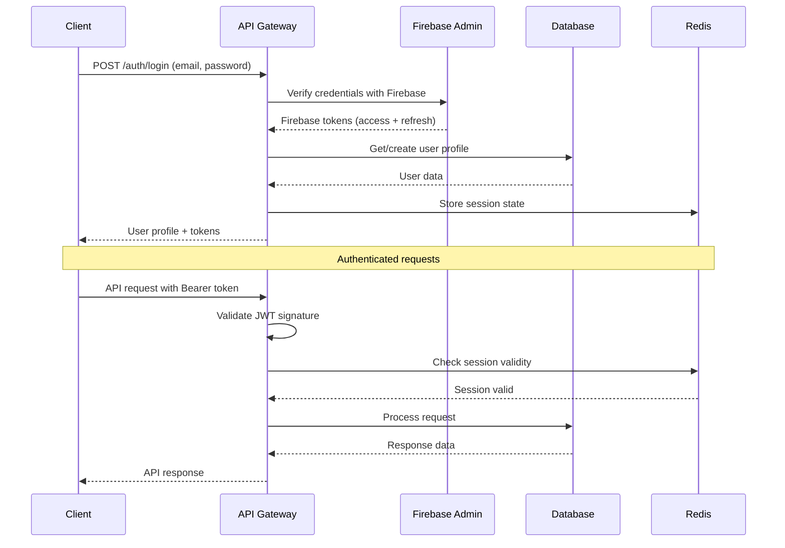

# Dopamine Hero Backend Architecture

## Backend Architecture

Based on Node.js with Express.js and TypeScript, the backend architecture implements a modular monolith pattern that supports the complex dual-currency calculations while maintaining clear scaling paths for future microservice extraction.

### Service Architecture

#### Controller/Route Organization

```
src/
├── routes/
│   ├── auth.ts          # Authentication routes
│   ├── users.ts         # User profile and stats
│   ├── tasks.ts         # Task management
│   ├── focus-sessions.ts # Focus session lifecycle
│   ├── modules.ts       # Module catalog and purchasing
│   ├── presets.ts       # Preset management
│   └── index.ts         # Route aggregation
├── services/
│   ├── auth/            # Authentication business logic
│   ├── users/           # User management
│   ├── tasks/           # Task business logic
│   ├── focus/           # Session management
│   ├── modules/         # Game logic calculations
│   ├── currency/        # Economic calculations
│   └── analytics/       # Statistics and insights
├── models/
│   ├── User.ts          # User data model
│   ├── Task.ts          # Task data model
│   ├── Module.ts        # Module data model
│   └── associations.ts  # Model relationships
├── middleware/
│   ├── auth.ts          # JWT validation
│   ├── validation.ts    # Request validation
│   ├── rateLimit.ts     # Rate limiting
│   └── errorHandler.ts  # Global error handling
├── utils/
│   ├── database.ts      # Database connection
│   ├── redis.ts         # Redis client
│   ├── logger.ts        # Winston logger
│   └── validation.ts    # Joi schemas
└── types/
    ├── express.ts       # Express type extensions
    ├── api.ts           # API type definitions
    └── database.ts      # Database types
```

#### Controller Template

```typescript
// src/routes/focus-sessions.ts
import { Router } from 'express';
import { body, param, query } from 'express-validator';
import { FocusSessionService } from '@/services/focus/FocusSessionService';
import { CurrencyService } from '@/services/currency/CurrencyService';
import { validateRequest } from '@/middleware/validation';
import { authenticate } from '@/middleware/auth';
import { asyncHandler } from '@/utils/asyncHandler';

const router = Router();
const focusSessionService = new FocusSessionService();
const currencyService = new CurrencyService();

// Create new focus session
router.post('/',
  authenticate,
  [
    body('taskId').optional().isUUID(),
    body('plannedDuration').isInt({ min: 1, max: 120 }),
    body('moduleConfigurationId').optional().isUUID()
  ],
  validateRequest,
  asyncHandler(async (req, res) => {
    const userId = req.user!.id;
    const { taskId, plannedDuration, moduleConfigurationId } = req.body;

    const session = await focusSessionService.createSession({
      userId,
      taskId,
      plannedDuration,
      moduleConfigurationId
    });

    res.status(201).json({
      success: true,
      data: session,
      message: 'Focus session created successfully'
    });
  })
);

// Start focus session
router.post('/:sessionId/start',
  authenticate,
  [param('sessionId').isUUID()],
  validateRequest,
  asyncHandler(async (req, res) => {
    const { sessionId } = req.params;
    const userId = req.user!.id;

    const session = await focusSessionService.startSession(sessionId, userId);

    res.json({
      success: true,
      data: session,
      message: 'Focus session started'
    });
  })
);

// Complete focus session
router.post('/:sessionId/complete',
  authenticate,
  [
    param('sessionId').isUUID(),
    body('actualDuration').optional().isInt({ min: 1 })
  ],
  validateRequest,
  asyncHandler(async (req, res) => {
    const { sessionId } = req.params;
    const userId = req.user!.id;
    const { actualDuration } = req.body;

    const result = await focusSessionService.completeSession(
      sessionId,
      userId,
      actualDuration
    );

    res.json({
      success: true,
      data: {
        session: result.session,
        energyEarned: result.energyEarned,
        dopamineEarned: result.dopamineEarned,
        taskCompleted: result.taskCompleted
      },
      message: 'Focus session completed successfully'
    });
  })
);

export { router as focusSessionsRouter };
```

#### Service Layer Example

```typescript
// src/services/focus/FocusSessionService.ts
import { FocusSession, Task, UserModule, ModulePreset } from '@/types';
import { DatabaseService } from '@/utils/database';
import { RedisService } from '@/utils/redis';
import { CurrencyService } from '@/services/currency/CurrencyService';
import { ModuleCalculationService } from '@/services/modules/ModuleCalculationService';
import { logger } from '@/utils/logger';

export interface CreateSessionData {
  userId: string;
  taskId?: string;
  plannedDuration: number;
  moduleConfigurationId?: string;
}

export interface SessionCompletionResult {
  session: FocusSession;
  energyEarned: number;
  dopamineEarned: number;
  taskCompleted: boolean;
}

export class FocusSessionService {
  constructor(
    private db: DatabaseService,
    private redis: RedisService,
    private currencyService: CurrencyService,
    private moduleCalculation: ModuleCalculationService
  ) {}

  async createSession(data: CreateSessionData): Promise<FocusSession> {
    logger.info('Creating focus session', { userId: data.userId, taskId: data.taskId });

    // Validate user has access to task if specified
    if (data.taskId) {
      const task = await this.db.tasks.findById(data.taskId);
      if (!task || task.userId !== data.userId) {
        throw new Error('Task not found or access denied');
      }
    }

    // Validate module configuration if specified
    let dopamineGenerationRate = 0;
    if (data.moduleConfigurationId) {
      const preset = await this.validateModuleConfiguration(
        data.moduleConfigurationId,
        data.userId
      );
      dopamineGenerationRate = preset.dopamineGenerationRate;
    }

    const session = await this.db.focusSessions.create({
      userId: data.userId,
      taskId: data.taskId,
      moduleConfigurationId: data.moduleConfigurationId,
      plannedDuration: data.plannedDuration,
      status: 'planned',
      startTime: new Date()
    });

    // Cache session in Redis for real-time updates
    await this.redis.setex(
      `session:${session.id}`,
      data.plannedDuration * 60, // TTL for session duration
      JSON.stringify({
        ...session,
        dopamineGenerationRate
      })
    );

    logger.info('Focus session created', { sessionId: session.id });
    return session;
  }

  async startSession(sessionId: string, userId: string): Promise<FocusSession> {
    const session = await this.validateSessionAccess(sessionId, userId);

    if (session.status !== 'planned') {
      throw new Error('Session can only be started from planned status');
    }

    const updatedSession = await this.db.focusSessions.update(sessionId, {
      status: 'active',
      startTime: new Date()
    });

    // Update Redis cache
    await this.redis.setex(
      `session:${sessionId}`,
      updatedSession.plannedDuration * 60,
      JSON.stringify({
        ...updatedSession,
        startTime: updatedSession.startTime
      })
    );

    logger.info('Focus session started', { sessionId, userId });
    return updatedSession;
  }

  async completeSession(
    sessionId: string,
    userId: string,
    actualDuration?: number
  ): Promise<SessionCompletionResult> {
    const session = await this.validateSessionAccess(sessionId, userId);

    if (session.status !== 'active') {
      throw new Error('Only active sessions can be completed');
    }

    const endTime = new Date();
    const duration = actualDuration || Math.floor(
      (endTime.getTime() - session.startTime!.getTime()) / 1000 / 60
    );

    // Calculate energy earned
    const energyEarned = this.calculateEnergyEarned(session, duration);

    // Calculate dopamine earned from module configuration
    const dopamineEarned = await this.calculateDopamineEarned(session, duration);

    // Update session
    const updatedSession = await this.db.focusSessions.update(sessionId, {
      status: 'completed',
      endTime,
      actualDuration: duration,
      energyGenerated: energyEarned,
      dopamineGenerated: dopamineEarned
    });

    // Process currency rewards
    await this.currencyService.processSessionRewards(
      userId,
      energyEarned,
      dopamineEarned,
      sessionId
    );

    // Update task completion if applicable
    let taskCompleted = false;
    if (session.taskId) {
      taskCompleted = await this.updateTaskCompletion(session.taskId);
    }

    // Clean up Redis cache
    await this.redis.del(`session:${sessionId}`);

    logger.info('Focus session completed', {
      sessionId,
      duration,
      energyEarned,
      dopamineEarned,
      taskCompleted
    });

    return {
      session: updatedSession,
      energyEarned,
      dopamineEarned,
      taskCompleted
    };
  }

  private calculateEnergyEarned(session: FocusSession, duration: number): number {
    // Base energy calculation: 1 energy per minute
    let baseEnergy = duration;

    // Task category bonuses
    if (session.task) {
      const categoryBonuses = {
        'analytical': 1.2,
        'creative': 1.1,
        'learning': 1.15,
        'physical': 0.9
      };
      baseEnergy *= categoryBonuses[session.task.category] || 1.0;
    }

    // Duration bonuses (reward longer sessions)
    if (duration >= 25) {
      baseEnergy *= 1.1; // 10% bonus for 25+ minutes
    }
    if (duration >= 50) {
      baseEnergy *= 1.2; // Additional 10% for 50+ minutes
    }

    // Interruption penalties
    if (session.interruptionCount > 0) {
      baseEnergy *= Math.max(0.5, 1 - (session.interruptionCount * 0.1));
    }

    return Math.round(baseEnergy * 100) / 100; // Round to 2 decimal places
  }

  private async calculateDopamineEarned(
    session: FocusSession,
    duration: number
  ): Promise<number> {
    if (!session.moduleConfigurationId) {
      return 0;
    }

    const cachedSession = await this.redis.get(`session:${session.id}`);
    if (!cachedSession) {
      logger.warn('Session cache not found for dopamine calculation', { sessionId: session.id });
      return 0;
    }

    const { dopamineGenerationRate } = JSON.parse(cachedSession);
    return Math.round(dopamineGenerationRate * duration * 10000) / 10000; // Round to 4 decimal places
  }

  private async validateModuleConfiguration(
    configId: string,
    userId: string
  ): Promise<ModulePreset> {
    const preset = await this.db.modulePresets.findById(configId);

    if (!preset || preset.userId !== userId) {
      throw new Error('Module configuration not found or access denied');
    }

    if (!preset.isActive) {
      throw new Error('Module configuration is not active');
    }

    // Validate user owns all required modules
    const userModuleIds = await this.db.userModules.findByUserId(userId)
      .then(modules => modules.map(um => um.moduleId));

    const requiredModuleIds = preset.configuration.map(config => config.userModuleId);

    for (const moduleId of requiredModuleIds) {
      if (!userModuleIds.includes(moduleId)) {
        throw new Error(`User does not own required module: ${moduleId}`);
      }
    }

    return preset;
  }

  private async validateSessionAccess(sessionId: string, userId: string): Promise<FocusSession> {
    const session = await this.db.focusSessions.findById(sessionId);

    if (!session) {
      throw new Error('Focus session not found');
    }

    if (session.userId !== userId) {
      throw new Error('Access denied to focus session');
    }

    return session;
  }

  private async updateTaskCompletion(taskId: string): Promise<boolean> {
    const task = await this.db.tasks.findById(taskId);
    if (!task) return false;

    if (task.status !== 'completed') {
      await this.db.tasks.update(taskId, {
        status: 'completed',
        completedAt: new Date()
      });
      return true;
    }

    return false;
  }
}
```

### Database Architecture

#### Schema Design

```typescript
// src/models/User.ts
import { Pool } from 'pg';
import { User, UserPreferences, CreateUserRequest } from '@/types';

export class UserModel {
  constructor(private db: Pool) {}

  async create(userData: CreateUserRequest): Promise<User> {
    const query = `
      INSERT INTO users (email, display_name, firebase_uid, preferences)
      VALUES ($1, $2, $3, $4)
      RETURNING id, email, display_name, avatar_url, firebase_uid, created_at, updated_at, preferences
    `;

    const values = [
      userData.email,
      userData.displayName,
      userData.firebaseUid,
      JSON.stringify(userData.preferences || {})
    ];

    const result = await this.db.query(query, values);
    return this.mapRowToUser(result.rows[0]);
  }

  async findById(id: string): Promise<User | null> {
    const query = `
      SELECT id, email, display_name, avatar_url, firebase_uid, created_at, updated_at, preferences
      FROM users
      WHERE id = $1
    `;

    const result = await this.db.query(query, [id]);
    return result.rows.length > 0 ? this.mapRowToUser(result.rows[0]) : null;
  }

  async findByFirebaseUid(firebaseUid: string): Promise<User | null> {
    const query = `
      SELECT id, email, display_name, avatar_url, firebase_uid, created_at, updated_at, preferences
      FROM users
      WHERE firebase_uid = $1
    `;

    const result = await this.db.query(query, [firebaseUid]);
    return result.rows.length > 0 ? this.mapRowToUser(result.rows[0]) : null;
  }

  async update(id: string, updates: Partial<User>): Promise<User | null> {
    const fields = [];
    const values = [];
    let paramIndex = 1;

    if (updates.displayName) {
      fields.push(`display_name = $${paramIndex++}`);
      values.push(updates.displayName);
    }

    if (updates.avatarUrl !== undefined) {
      fields.push(`avatar_url = $${paramIndex++}`);
      values.push(updates.avatarUrl);
    }

    if (updates.preferences) {
      fields.push(`preferences = $${paramIndex++}`);
      values.push(JSON.stringify(updates.preferences));
    }

    if (fields.length === 0) {
      return this.findById(id);
    }

    fields.push(`updated_at = CURRENT_TIMESTAMP`);
    values.push(id);

    const query = `
      UPDATE users
      SET ${fields.join(', ')}
      WHERE id = $${paramIndex}
      RETURNING id, email, display_name, avatar_url, firebase_uid, created_at, updated_at, preferences
    `;

    const result = await this.db.query(query, values);
    return result.rows.length > 0 ? this.mapRowToUser(result.rows[0]) : null;
  }

  private mapRowToUser(row: any): User {
    return {
      id: row.id,
      email: row.email,
      displayName: row.display_name,
      avatarUrl: row.avatar_url,
      firebaseUid: row.firebase_uid,
      createdAt: row.created_at,
      updatedAt: row.updated_at,
      preferences: row.preferences
    };
  }
}
```

#### Data Access Layer (Repository Pattern)

```typescript
// src/utils/database.ts
import { Pool, PoolConfig } from 'pg';
import { logger } from './logger';

export class DatabaseService {
  private pool: Pool;

  constructor(config: PoolConfig) {
    this.pool = new Pool({
      ...config,
      max: 20, // Maximum number of connections
      idleTimeoutMillis: 30000,
      connectionTimeoutMillis: 2000,
    });

    this.pool.on('error', (err) => {
      logger.error('Database pool error', err);
    });
  }

  async query(text: string, params?: any[]): Promise<any> {
    const start = Date.now();
    try {
      const result = await this.pool.query(text, params);
      const duration = Date.now() - start;

      if (duration > 100) {
        logger.warn('Slow query detected', { query: text, duration, params });
      }

      return result;
    } catch (error) {
      logger.error('Database query error', { query: text, params, error });
      throw error;
    }
  }

  async transaction<T>(callback: (client: any) => Promise<T>): Promise<T> {
    const client = await this.pool.connect();
    try {
      await client.query('BEGIN');
      const result = await callback(client);
      await client.query('COMMIT');
      return result;
    } catch (error) {
      await client.query('ROLLBACK');
      throw error;
    } finally {
      client.release();
    }
  }

  // Repository instances
  get users() {
    return new UserModel(this.pool);
  }

  get tasks() {
    return new TaskModel(this.pool);
  }

  get focusSessions() {
    return new FocusSessionModel(this.pool);
  }

  get modules() {
    return new ModuleModel(this.pool);
  }

  async healthCheck(): Promise<boolean> {
    try {
      await this.query('SELECT 1');
      return true;
    } catch (error) {
      logger.error('Database health check failed', error);
      return false;
    }
  }

  async close(): Promise<void> {
    await this.pool.end();
  }
}
```

### Authentication and Authorization

#### Auth Flow



#### Middleware/Guards

```typescript
// src/middleware/auth.ts
import { Request, Response, NextFunction } from 'express';
import admin from 'firebase-admin';
import { redisClient } from '@/utils/redis';
import { logger } from '@/utils/logger';
import { UnauthorizedError } from '@/utils/errors';

interface AuthenticatedRequest extends Request {
  user?: {
    id: string;
    email: string;
    firebaseUid: string;
  };
}

export const authenticate = async (
  req: AuthenticatedRequest,
  res: Response,
  next: NextFunction
): Promise<void> => {
  try {
    const authHeader = req.headers.authorization;

    if (!authHeader?.startsWith('Bearer ')) {
      throw new UnauthorizedError('Missing or invalid authorization header');
    }

    const token = authHeader.substring(7);

    // Verify JWT with Firebase Admin
    const decodedToken = await admin.auth().verifyIdToken(token);

    // Check session in Redis for additional security
    const sessionKey = `session:${decodedToken.uid}`;
    const sessionData = await redisClient.get(sessionKey);

    if (!sessionData) {
      throw new UnauthorizedError('Session not found or expired');
    }

    // Attach user info to request
    req.user = {
      id: JSON.parse(sessionData).userId,
      email: decodedToken.email!,
      firebaseUid: decodedToken.uid
    };

    // Refresh session TTL
    await redisClient.expire(sessionKey, 3600); // 1 hour

    next();
  } catch (error) {
    logger.warn('Authentication failed', {
      error: error.message,
      headers: req.headers
    });

    next(new UnauthorizedError('Authentication failed'));
  }
};

export const authorize = (requiredPermissions: string[]) => {
  return (req: AuthenticatedRequest, res: Response, next: NextFunction) => {
    // Future: Add role-based authorization if needed
    // For now, all authenticated users have full access to their own data
    next();
  };
};
```

### Backend Architecture Rationale

1. **Modular Service Layer:** Clear separation between routes (HTTP concerns) and services (business logic) supports testing and future microservice extraction
2. **Database Abstraction:** Repository pattern enables easy database migration and mocking for tests
3. **Transaction Support:** Complex dual-currency operations wrapped in database transactions for consistency
4. **Redis Integration:** Session state and caching for sub-200ms response times required by ADHD users
5. **Firebase Integration:** Leverages Firebase Auth for security while maintaining user data in PostgreSQL
6. **Error Handling:** Comprehensive error handling with proper HTTP status codes and logging
7. **Type Safety:** Full TypeScript coverage catches errors at build time for complex game logic calculations