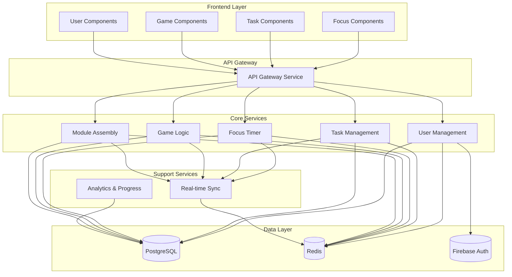

# Dopamine Hero Component Architecture

Based on the architectural patterns, tech stack, and data models, here are the major logical components across the fullstack:

## Major System Components

### User Management Service
**Responsibility:** Handles authentication, user profiles, preferences, and session management across web and mobile platforms.

**Key Interfaces:**
- User registration, login, logout workflows
- Profile management and preference updates
- JWT token generation and refresh
- Social login integration (Google, GitHub)

**Dependencies:** Firebase Auth, PostgreSQL, Redis
**Technology Stack:** Express.js middleware, JWT, bcrypt, OAuth2 clients

### Task Management Engine
**Responsibility:** Core productivity functionality including task CRUD operations, categorization, and task-to-energy conversion logic.

**Key Interfaces:**
- Task creation, editing, deletion, completion
- Task categorization and filtering
- Task analytics and productivity insights
- Task scheduling and reminder system

**Dependencies:** PostgreSQL, Redis, User Management Service
**Technology Stack:** Express.js routes, repository pattern, task scheduling libraries

### Focus Timer Service
**Responsibility:** Manages focus sessions, timer state, energy generation calculations, and session persistence across devices.

**Key Interfaces:**
- Session start, pause, resume, completion
- Real-time timer synchronization
- Energy generation calculations
- Session history and analytics

**Dependencies:** Redis, Task Management Engine, User Management Service
**Technology Stack:** WebSocket connections, state management, timing utilities

### Game Logic Engine
**Responsibility:** Core gaming mechanics including module effects, assembly validation, energy economy, and progression calculations.

**Key Interfaces:**
- Module acquisition and ownership validation
- Assembly configuration and effect calculations
- Energy transaction processing
- Progression and achievement systems

**Dependencies:** PostgreSQL, Redis, Focus Timer Service
**Technology Stack:** Game logic calculation engine, event-driven architecture, state machines

### Module Assembly System
**Responsibility:** Manages synth module interactions, preset management, and visual assembly interface logic.

**Key Interfaces:**
- Drag-and-drop assembly validation
- Module connection and interaction logic
- Preset save/load functionality
- Assembly effect preview and calculation

**Dependencies:** Game Logic Engine, User Management Service
**Technology Stack:** Component-based architecture, state management, validation engine

### Analytics & Progress Service
**Responsibility:** Tracks user behavior, generates insights, manages achievements, and provides progress analytics.

**Key Interfaces:**
- User statistics calculation and aggregation
- Productivity pattern analysis
- Achievement tracking and unlocking
- Performance metrics and insights

**Dependencies:** PostgreSQL, all other services
**Technology Stack:** Data aggregation pipelines, analytics calculation, reporting tools

### Real-time Sync Service
**Responsibility:** Ensures data consistency across web and mobile clients with real-time updates and offline support.

**Key Interfaces:**
- Cross-device state synchronization
- Offline change detection and merging
- Real-time updates via WebSockets
- Conflict resolution for simultaneous edits

**Dependencies:** Redis, all other services
**Technology Stack:** WebSocket server, event-driven architecture, conflict resolution algorithms

### API Gateway Service
**Responsibility:** Single entry point for all API requests with authentication, rate limiting, and request routing.

**Key Interfaces:**
- Request authentication and authorization
- Rate limiting and throttling
- Request logging and monitoring
- CORS and security headers

**Dependencies:** All other services
**Technology Stack:** Express.js middleware, JWT validation, rate limiting libraries

### Frontend Component System
**Responsibility:** React-based UI components supporting both Focus Mode and Game Mode with responsive design and cross-platform compatibility.

**Key Interfaces:**
- Focus timer UI with real-time updates
- Task management interface with drag-and-drop
- Module assembly visualization with animations
- User dashboard and analytics displays

**Dependencies:** All backend services via REST API
**Technology Stack:** React 18, TypeScript, Tailwind CSS, Framer Motion, Zustand

## Component Interaction Diagram



## Service Details and Implementation Patterns

### User Management Service Implementation

```typescript
// apps/api/src/services/userService.ts
export class UserService {
  constructor(
    private userRepo: UserRepository,
    private firebaseAuth: FirebaseAuthService,
    private cacheService: CacheService
  ) {}

  async register(userData: RegisterData): Promise<AuthResponse> {
    // 1. Validate user data
    await this.validateRegistrationData(userData);

    // 2. Create Firebase Auth user
    const firebaseUser = await this.firebaseAuth.createUser({
      email: userData.email,
      password: userData.password,
      displayName: userData.displayName
    });

    // 3. Create database user record
    const user = await this.userRepo.create({
      id: firebaseUser.uid,
      email: userData.email,
      displayName: userData.displayName,
      preferences: this.getDefaultPreferences(),
      energy: 0,
      level: 1,
      experience: 0,
      subscriptionTier: 'free'
    });

    // 4. Create initial stats record
    await this.createUserStats(user.id);

    // 5. Generate tokens
    const tokens = await this.generateTokens(user);

    // 6. Cache user session
    await this.cacheService.setUserSession(user.id, user);

    return {
      user: this.sanitizeUser(user),
      ...tokens
    };
  }

  async login(email: string, password: string): Promise<AuthResponse> {
    // 1. Authenticate with Firebase
    const firebaseUser = await this.firebaseAuth.signIn(email, password);

    // 2. Get user from database
    let user = await this.userRepo.findById(firebaseUser.uid);

    // 3. Create user if doesn't exist (social login case)
    if (!user) {
      user = await this.userRepo.create({
        id: firebaseUser.uid,
        email: firebaseUser.email,
        displayName: firebaseUser.displayName || email.split('@')[0],
        preferences: this.getDefaultPreferences(),
        energy: 0,
        level: 1,
        experience: 0,
        subscriptionTier: 'free'
      });
      await this.createUserStats(user.id);
    }

    // 4. Update last login
    await this.userRepo.updateLastLogin(user.id);

    // 5. Generate tokens
    const tokens = await this.generateTokens(user);

    // 6. Cache user session
    await this.cacheService.setUserSession(user.id, user);

    return {
      user: this.sanitizeUser(user),
      ...tokens
    };
  }

  async updatePreferences(userId: string, preferences: Partial<UserPreferences>): Promise<User> {
    // 1. Validate preferences
    const validatedPreferences = this.validatePreferences(preferences);

    // 2. Update in database
    const user = await this.userRepo.updatePreferences(userId, validatedPreferences);

    // 3. Update cache
    await this.cacheService.updateUserPreferences(userId, validatedPreferences);

    // 4. Emit preferences updated event
    this.eventBus.emit('user:preferences_updated', { userId, preferences: validatedPreferences });

    return user;
  }
}
```

### Task Management Engine Implementation

```typescript
// apps/api/src/services/taskService.ts
export class TaskService {
  constructor(
    private taskRepo: TaskRepository,
    private energyService: EnergyService,
    private statsService: StatsService,
    private notificationService: NotificationService
  ) {}

  async createTask(userId: string, taskData: CreateTaskRequest): Promise<Task> {
    // 1. Validate task data
    const validatedData = await this.validateTaskData(taskData);

    // 2. Create task
    const task = await this.taskRepo.create(userId, validatedData);

    // 3. Update user stats
    await this.statsService.incrementTasksCreated(userId);

    // 4. Schedule reminder if due date set
    if (task.dueDate) {
      await this.notificationService.scheduleTaskReminder(task.id, task.dueDate);
    }

    // 5. Emit task created event
    this.eventBus.emit('task:created', { task, userId });

    return task;
  }

  async completeTask(userId: string, taskId: string, completionData?: TaskCompletionData): Promise<TaskCompletionResult> {
    // 1. Get task
    const task = await this.taskRepo.findById(taskId);
    if (!task || task.userId !== userId) {
      throw new NotFoundError('Task not found');
    }

    if (task.status === 'completed') {
      throw new BadRequestError('Task already completed');
    }

    // 2. Calculate energy reward
    const energyReward = this.calculateEnergyReward(task, completionData);

    // 3. Update task status
    const updatedTask = await this.taskRepo.update(taskId, {
      status: 'completed',
      completedAt: new Date()
    });

    // 4. Award energy to user
    await this.energyService.addEnergy(userId, energyReward, {
      source: 'task_completion',
      taskId: task.id,
      category: task.category
    });

    // 5. Update user stats
    await this.statsService.incrementTasksCompleted(userId);
    await this.statsService.updateStreak(userId);

    // 6. Check for achievements
    const achievements = await this.statsService.checkAchievements(userId);

    // 7. Cancel any pending reminders
    await this.notificationService.cancelTaskReminder(taskId);

    // 8. Emit task completed event
    this.eventBus.emit('task:completed', {
      task: updatedTask,
      userId,
      energyReward,
      achievements
    });

    return {
      task: updatedTask,
      energyEarned: energyReward,
      achievements
    };
  }

  private calculateEnergyReward(task: Task, completionData?: TaskCompletionData): number {
    let baseReward = this.getBaseEnergyReward(task.category);

    // Adjust based on task duration
    if (task.estimatedDuration) {
      const durationBonus = Math.min(task.estimatedDuration / 30, 2); // Max 2x bonus for 60+ min tasks
      baseReward *= (1 + durationBonus * 0.5);
    }

    // Adjust based on priority
    const priorityMultiplier = {
      low: 0.8,
      medium: 1.0,
      high: 1.3
    };
    baseReward *= priorityMultiplier[task.priority];

    // Quality bonus if provided
    if (completionData?.quality) {
      const qualityMultiplier = {
        poor: 0.7,
        fair: 0.9,
        good: 1.1,
        excellent: 1.3
      };
      baseReward *= qualityMultiplier[completionData.quality];
    }

    return Math.round(baseReward);
  }
}
```

### Focus Timer Service Implementation

```typescript
// apps/api/src/services/focusTimerService.ts
export class FocusTimerService {
  constructor(
    private sessionRepo: FocusSessionRepository,
    private energyService: EnergyService,
    private taskService: TaskService,
    private realtimeService: RealtimeService
  ) {}

  async startSession(userId: string, sessionData: CreateFocusSessionRequest): Promise<FocusSession> {
    // 1. Validate session data
    const validatedData = this.validateSessionData(sessionData);

    // 2. Check for active session
    const activeSession = await this.sessionRepo.findActiveByUserId(userId);
    if (activeSession) {
      throw new BadRequestError('User already has an active focus session');
    }

    // 3. Create focus session
    const session = await this.sessionRepo.create({
      userId,
      taskId: sessionData.taskId,
      duration: sessionData.duration,
      startedAt: new Date(),
      status: 'active',
      interruptions: 0
    });

    // 4. Start real-time timer tracking
    await this.realtimeService.startTimer(session.id, sessionData.duration);

    // 5. Notify connected clients
    await this.realtimeService.broadcastToUser(userId, {
      type: 'session_started',
      session: this.sanitizeSession(session)
    });

    // 6. Emit session started event
    this.eventBus.emit('focus:session_started', { session, userId });

    return session;
  }

  async completeSession(userId: string, sessionId: string, completionData: CompleteSessionRequest): Promise<SessionCompletionResult> {
    // 1. Get session
    const session = await this.sessionRepo.findById(sessionId);
    if (!session || session.userId !== userId) {
      throw new NotFoundError('Session not found');
    }

    if (session.status !== 'active') {
      throw new BadRequestError('Session is not active');
    }

    // 2. Calculate session metrics
    const endTime = new Date();
    const actualDuration = Math.round((endTime.getTime() - session.startedAt.getTime()) / 60000); // minutes

    // 3. Calculate energy generated
    const baseEnergy = this.calculateBaseEnergy(session.duration, session.taskId);
    const efficiencyBonus = this.calculateEfficiencyBonus(session.duration, actualDuration);
    const qualityBonus = this.getQualityBonus(completionData.quality);
    const totalEnergy = Math.round(baseEnergy * efficiencyBonus * qualityBonus);

    // 4. Update session
    const updatedSession = await this.sessionRepo.update(sessionId, {
      actualDuration,
      energyGenerated: totalEnergy,
      endedAt: endTime,
      quality: completionData.quality,
      notes: completionData.notes,
      status: 'completed'
    });

    // 5. Award energy to user
    await this.energyService.addEnergy(userId, totalEnergy, {
      source: 'focus_session',
      sessionId: session.id,
      duration: actualDuration
    });

    // 6. Update user stats
    await this.statsService.updateFocusStats(userId, actualDuration, totalEnergy);

    // 7. Complete associated task if provided
    let taskCompletionResult = null;
    if (session.taskId) {
      taskCompletionResult = await this.taskService.completeTask(userId, session.taskId, {
        quality: completionData.quality,
        notes: completionData.notes
      });
    }

    // 8. Stop real-time timer
    await this.realtimeService.stopTimer(sessionId);

    // 9. Notify connected clients
    await this.realtimeService.broadcastToUser(userId, {
      type: 'session_completed',
      session: this.sanitizeSession(updatedSession),
      energyEarned: totalEnergy,
      taskCompletion: taskCompletionResult
    });

    // 10. Emit session completed event
    this.eventBus.emit('focus:session_completed', {
      session: updatedSession,
      userId,
      energyEarned: totalEnergy,
      taskCompletion: taskCompletionResult
    });

    return {
      session: updatedSession,
      energyGenerated: totalEnergy,
      taskCompletion: taskCompletionResult
    };
  }

  private calculateBaseEnergy(plannedDuration: number, taskId?: string): number {
    // Base energy generation rate
    let baseRate = 1.0; // energy per minute

    // Bonus for having associated task
    if (taskId) {
      baseRate *= 1.5;
    }

    // Longer sessions generate more energy per minute (encourages longer focus)
    if (plannedDuration >= 45) {
      baseRate *= 1.3;
    } else if (plannedDuration >= 30) {
      baseRate *= 1.2;
    }

    return Math.round(baseRate * plannedDuration);
  }

  private calculateEfficiencyBonus(plannedDuration: number, actualDuration: number): number {
    const efficiency = actualDuration / plannedDuration;

    // Bonus for completing planned time (100-110% efficiency)
    if (efficiency >= 1.0 && efficiency <= 1.1) {
      return 1.2;
    }

    // Small penalty for under-completing (<90% efficiency)
    if (efficiency < 0.9) {
      return 0.8;
    }

    // Neutral efficiency
    return 1.0;
  }
}
```

## Frontend Component Architecture

### Component Organization Structure

```
apps/web/src/components/
├── ui/                     # Reusable UI primitives
│   ├── Button/
│   ├── Input/
│   ├── Modal/
│   ├── Card/
│   └── index.ts
├── features/               # Feature-specific components
│   ├── auth/
│   │   ├── LoginForm/
│   │   ├── RegisterForm/
│   │   └── AuthProvider/
│   ├── focus/
│   │   ├── Timer/
│   │   ├── TaskList/
│   │   ├── EnergyCounter/
│   │   └── FocusDashboard/
│   ├── tasks/
│   │   ├── TaskCard/
│   │   ├── TaskForm/
│   │   ├── TaskFilters/
│   │   └── TaskManager/
│   └── game/
│       ├── ModuleCatalog/
│       ├── ModuleAssembly/
│       ├── PresetManager/
│       └── SynthRack/
├── layout/                 # Layout components
│   ├── Header/
│   ├── Sidebar/
│   ├── Navigation/
│   └── LayoutProvider/
└── shared/                 # Cross-feature components
    ├── ErrorBoundary/
    ├── LoadingSpinner/
    ├── NotificationToast/
    └── ThemeProvider/
```

### Key Component Implementation Patterns

#### Timer Component (Game-Ready Performance)
```typescript
// apps/web/src/components/focus/Timer/Timer.tsx
import React, { useEffect, useRef, useCallback } from 'react';
import { motion } from 'framer-motion';
import { useFocusTimer } from '@/shared/hooks/useFocusTimer';
import { useWebSocket } from '@/shared/hooks/useWebSocket';

interface TimerProps {
  sessionId?: string;
  onSessionComplete?: (result: SessionCompletionResult) => void;
}

export const Timer: React.FC<TimerProps> = ({ sessionId, onSessionComplete }) => {
  const {
    currentSession,
    isActive,
    isPaused,
    timeRemaining,
    startSession,
    pauseSession,
    resumeSession,
    completeSession
  } = useFocusTimer();

  const { sendMessage } = useWebSocket();
  const animationFrameRef = useRef<number>();
  const lastTimeRef = useRef<number>(0);

  // High-precision timer implementation
  useEffect(() => {
    if (isActive && !isPaused) {
      const animate = (currentTime: number) => {
        if (lastTimeRef.current === 0) {
          lastTimeRef.current = currentTime;
        }

        const deltaTime = currentTime - lastTimeRef.current;
        lastTimeRef.current = currentTime;

        // Update timer with high precision
        if (deltaTime >= 1000) { // Update every second
          // Timer update logic here
          lastTimeRef.current = currentTime;
        }

        animationFrameRef.current = requestAnimationFrame(animate);
      };

      animationFrameRef.current = requestAnimationFrame(animate);
    }

    return () => {
      if (animationFrameRef.current) {
        cancelAnimationFrame(animationFrameRef.current);
      }
    };
  }, [isActive, isPaused]);

  const handleStart = useCallback(() => {
    startSession({ duration: 1500 }); // 25 minutes default
  }, [startSession]);

  const handleComplete = useCallback(async () => {
    if (!currentSession) return;

    const result = await completeSession(currentSession.id, {
      actualDuration: currentSession.duration - Math.ceil(timeRemaining / 60),
      quality: 'good'
    });

    onSessionComplete?.(result);
    sendMessage({
      type: 'session_completed',
      data: result
    });
  }, [currentSession, timeRemaining, completeSession, onSessionComplete, sendMessage]);

  const formatTime = useCallback((seconds: number): string => {
    const minutes = Math.floor(seconds / 60);
    const remainingSeconds = seconds % 60;
    return `${minutes.toString().padStart(2, '0')}:${remainingSeconds.toString().padStart(2, '0')}`;
  }, []);

  return (
    <motion.div
      className="timer-container"
      initial={{ scale: 0.9, opacity: 0 }}
      animate={{ scale: 1, opacity: 1 }}
      transition={{ duration: 0.3 }}
    >
      <div className="timer-display">
        <motion.span
          className="timer-text"
          key={timeRemaining}
          initial={{ y: -10, opacity: 0 }}
          animate={{ y: 0, opacity: 1 }}
          transition={{ type: "spring", stiffness: 300 }}
        >
          {formatTime(timeRemaining)}
        </motion.span>
      </div>

      <div className="timer-controls">
        {!isActive ? (
          <motion.button
            className="start-button"
            onClick={handleStart}
            whileHover={{ scale: 1.05 }}
            whileTap={{ scale: 0.95 }}
          >
            Start Focus
          </motion.button>
        ) : (
          <>
            {!isPaused ? (
              <motion.button
                className="pause-button"
                onClick={pauseSession}
                whileHover={{ scale: 1.05 }}
                whileTap={{ scale: 0.95 }}
              >
                Pause
              </motion.button>
            ) : (
              <motion.button
                className="resume-button"
                onClick={resumeSession}
                whileHover={{ scale: 1.05 }}
                whileTap={{ scale: 0.95 }}
              >
                Resume
              </motion.button>
            )}
            <motion.button
              className="complete-button"
              onClick={handleComplete}
              whileHover={{ scale: 1.05 }}
              whileTap={{ scale: 0.95 }}
            >
              Complete
            </motion.button>
          </>
        )}
      </div>
    </motion.div>
  );
};
```

This comprehensive component architecture provides:

1. **Clear Service Boundaries**: Each service has focused responsibilities with well-defined interfaces
2. **Real-Time Capabilities**: WebSocket integration for live updates and synchronization
3. **Performance Optimization**: High-precision timers and optimized rendering for game mechanics
4. **Cross-Platform Compatibility**: Shared logic and types for React Native implementation
5. **Event-Driven Architecture**: Loose coupling through event-based communication
6. **Error Handling**: Comprehensive error handling and recovery mechanisms
7. **Scalability Foundation**: Service-oriented design ready for microservice extraction