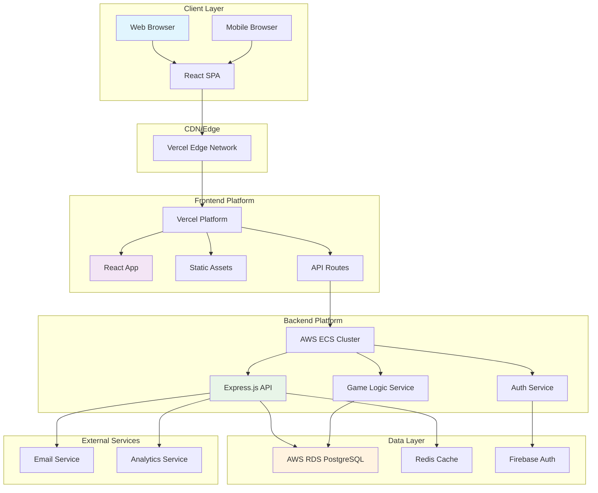

# Dopamine Hero Fullstack Architecture Document

## Introduction

This document outlines the complete fullstack architecture for Dopamine Hero, including backend systems, frontend implementation, and their integration. It serves as the single source of truth for AI-driven development, ensuring consistency across the entire technology stack.

This unified approach combines what would traditionally be separate backend and frontend architecture documents, streamlining the development process for modern fullstack applications where these concerns are increasingly intertwined.

### Starter Template or Existing Project

**N/A - Greenfield project**

Based on the PRD analysis, this is a greenfield project with no existing codebase or starter template constraints. The PRD specifies clear technical preferences including:

- **Monorepo structure** with modular organization
- **React 18+ with TypeScript** for frontend
- **Node.js with Express.js** for backend
- **PostgreSQL + Redis** for data storage
- **Vercel + AWS** for deployment

The architecture will be designed from scratch to support the unique hybrid productivity/gaming requirements without legacy constraints.

### Change Log

| Date | Version | Description | Author |
|------|---------|-------------|--------|
| 2025-10-17 | v1.0 | Initial fullstack architecture creation | Winston (Architect) |

## High Level Architecture

### Technical Summary

Dopamine Hero employs a modern modular monolith architecture designed for solo/agent-driven development, featuring a React-based single-page application with Node.js/Express backend, PostgreSQL database with Redis caching, and serverless-friendly deployment on Vercel/AWS. The architecture prioritizes real-time responsiveness for the focus timer and module assembly game mechanics, while maintaining clean separation between productivity functionality and gaming systems through well-defined internal modules. This approach provides operational simplicity for initial development while preserving clear scaling paths to microservices as user growth demands, all within a cost-conscious infrastructure budget optimized for the ADHD productivity market.

### Platform and Infrastructure Choice

**Platform:** Vercel + AWS ECS Hybrid
**Key Services:** Vercel (Frontend), AWS ECS (Backend), AWS RDS PostgreSQL, Redis, Firebase Auth
**Deployment Host and Regions:** us-east-1 primary, with global CDN via Vercel

**Rationale for Platform Choice:**

After analyzing the requirements for Dopamine Hero, I recommend a hybrid approach that leverages the strengths of different platforms:

**Option 1: Vercel + Supabase**
- **Pros:** Rapid development, integrated auth/storage, excellent developer experience
- **Cons:** Less control over backend scaling, potential vendor lock-in
- **Verdict:** Excellent for MVP but may limit custom game logic optimization

**Option 2: AWS Full Stack**
- **Pros:** Maximum scalability, fine-grained control, comprehensive services
- **Cons:** Higher operational complexity, steeper learning curve, higher cost
- **Verdict:** Overkill for initial 10K users, necessary for 50K+ scale

**Option 3: Vercel + AWS ECS (Recommended)**
- **Pros:** Optimal React performance, scalable backend, cost-effective, clear migration path
- **Cons:** Requires managing two platforms
- **Verdict:** Best balance of developer productivity and scalability for Dopamine Hero's specific needs

This hybrid approach gives us Vercel's optimized React deployment and global CDN while maintaining backend flexibility for the complex game logic calculations that will differentiate Dopamine Hero.

### Repository Structure

**Structure:** Monorepo with npm workspaces
**Monorepo Tool:** npm workspaces (simpler than Nx/Turborepo for solo development)
**Package Organization:** Separate packages for frontend, backend, shared types, and UI components

The monorepo approach is specifically chosen for Dopamine Hero because it:

1. **Simplifies Type Sharing** - Critical for TypeScript interfaces used across frontend/backend
2. **Enables Code Reuse** - Shared validation logic and utilities between systems
3. **Streamlines Development** - Single repository for solo/agent developers
4. **Supports Future Separation** - Easy to extract services when scaling to microservices
5. **Reduces Coordination Overhead** - No cross-repo dependency management

### Architecture Diagram



### Architectural Patterns

- **Modular Monolith Architecture**: Single deployable unit with well-defined internal boundaries - *Rationale:* Simplifies deployment and operations while maintaining clean separation for future microservice extraction

- **Component-Based UI with React**: Reusable React components with TypeScript - *Rationale:* Type safety and component reusability across the productivity/game interface spectrum

- **Repository Pattern with Data Access Layer**: Abstract data access logic using repositories - *Rationale:* Enables testing, future database migration flexibility, and clean separation between business logic and data persistence

- **API Gateway Pattern**: Single entry point for all API calls with middleware - *Rationale:* Centralized authentication, rate limiting, and monitoring for the ADHD-focused performance requirements

- **Event-Driven Internal Architecture**: Internal modules communicate via events within the monolith - *Rationale:* Supports the real-time nature of focus timer and game mechanics while maintaining loose coupling

- **Progressive Web App (PWA)**: Native-like experience with offline capability - *Rationale:* Critical for focus timer functionality during internet interruptions and mobile productivity use

- **CQRS with Separate Read/Write Models**: Command Query Responsibility Segregation for complex data operations - *Rationale:* Optimizes performance for analytics queries while maintaining data integrity for game state

- **State Management with Zustand**: Client state management with selective persistence - *Rationale:* Balances complex state needs with simplicity, avoiding Redux overhead while supporting the productivity/game state complexity

**Rationale for Detailed Decision-Making:**

The architectural patterns above were specifically chosen to address Dopamine Hero's unique challenges:

1. **ADHD User Requirements**: The PWA pattern ensures the focus timer works reliably during connection issues, a critical need for neurodivergent users who may experience session disruption.

2. **Game-Performance Balance**: CQRS allows us to optimize the fast-paced game mechanics (writes) separately from the productivity analytics (reads), ensuring both systems perform optimally.

3. **Future Scaling Needs**: The modular monolith with event-driven internal communication provides clear extraction points when we need to scale specific components like the game logic service.

4. **Development Efficiency**: Component-based UI with TypeScript enables faster development and fewer bugs, crucial for solo/agent development teams.

## Tech Stack

This is the DEFINITIVE technology selection for Dopamine Hero. All development must use these exact versions to ensure consistency across AI agents and human developers.

### Technology Stack Table

| Category | Technology | Version | Purpose | Rationale |
|----------|------------|---------|---------|-----------|
| Frontend Language | TypeScript | 5.0+ | Type safety & better tooling | Essential for complex game logic and dual-currency system |
| Frontend Framework | React 18 | 18.2+ | Component-based UI framework | Best ecosystem for AI agent code generation & performance |
| UI Component Library | Custom + Tailwind CSS | 3.3+ | Unique synth aesthetic & design consistency | PRD requires custom retro-futuristic design, not achievable with standard libraries |
| State Management | Zustand | 4.4+ | Complex application state | Simpler than Redux, perfect for modular monolith, great TypeScript support |
| Backend Language | TypeScript | 5.0+ | Type safety across stack | Shared types between frontend/backend, critical for dual-currency system |
| Backend Framework | Express.js | 4.18+ | Web framework | Maximum ecosystem compatibility, proven AI agent integration |
| API Style | REST API | OpenAPI 3.0 | Standardized API design | Best documentation support, crucial for agent development |
| Database | PostgreSQL | 15+ | Primary data storage | Complex relationships for modules/configurations, ACID compliance for currency transactions |
| Cache | Redis | 7.0+ | Session management & real-time data | Essential for focus session state and dual-currency calculations |
| File Storage | AWS S3 | - | User assets & exports | Scalable, cost-effective, integrates with AWS infrastructure |
| Authentication | Firebase Auth | - | User authentication & social login | PRD requirement, reduces development complexity, excellent security |
| Frontend Testing | Vitest + React Testing Library | 0.34+ / 13.4+ | Unit & integration tests | Fast, modern, excellent TypeScript support |
| Backend Testing | Jest + Supertest | 29.7+ / 6.3+ | API testing | Comprehensive backend testing with good agent compatibility |
| E2E Testing | Playwright | 1.39+ | End-to-end testing | Cross-browser, reliable for complex user flows |
| Build Tool | Vite | 4.4+ | Fast development & building | Superior HMR for rapid development, excellent TypeScript support |
| Bundler | Vite | 4.4+ | Frontend bundling | Optimized for modern React applications |
| IaC Tool | AWS CDK | 2.100+ | Infrastructure as Code | TypeScript-based, better agent integration than Terraform |
| CI/CD | GitHub Actions | - | Automated testing & deployment | Native GitHub integration, excellent for agent workflows |
| Monitoring | Sentry | - | Error tracking & performance | Essential for ADHD performance requirements, good free tier |
| Logging | Winston | 3.10+ | Structured logging | Industry standard, excellent agent compatibility |
| CSS Framework | Tailwind CSS | 3.3+ | Utility-first CSS | Perfect for custom design system, agent-friendly |

### Detailed Rationale

The tech stack prioritizes AI agent compatibility and ADHD performance requirements. TypeScript across the full stack enables shared types for the complex dual-currency system. Zustand over Redux simplifies state management while maintaining the performance needed for real-time game calculations. Vite over Webpack provides faster development cycles crucial for rapid iteration. The PostgreSQL + Redis combination ensures ACID compliance for currency transactions while providing the real-time capabilities needed for focus session tracking.

### Key Trade-offs Made

- **Custom UI Library vs. Material-UI**: Chose custom with Tailwind to meet PRD's unique retro-futuristic synth aesthetic requirements
- **Zustand vs. Redux**: Simplified development while maintaining performance for complex state
- **REST vs. GraphQL**: REST chosen for better documentation and agent compatibility, despite GraphQL's efficiency for complex data
- **AWS CDK vs. Terraform**: TypeScript-based IaC provides better agent integration

## Data Models

Based on the PRD requirements, I've identified the core business entities that support the dual-currency economic system and focus-to-game loop. These models are designed to support real-time synchronization and complex game logic while maintaining performance for ADHD users.

### User

**Purpose:** Core user account management and authentication integration

**Key Attributes:**
- id: UUID - Primary identifier
- email: string - User email (unique)
- displayName: string - User's chosen display name
- avatar: string | null - Profile image URL
- createdAt: DateTime - Account creation timestamp
- updatedAt: DateTime - Last profile update
- preferences: UserPreferences - User settings and preferences

**TypeScript Interface:**
```typescript
interface User {
  id: string;
  email: string;
  displayName: string;
  avatar?: string;
  createdAt: Date;
  updatedAt: Date;
  preferences: UserPreferences;
}

interface UserPreferences {
  focusSessionDuration: number; // Default 25 minutes
  theme: 'light' | 'dark' | 'auto';
  notifications: NotificationPreferences;
  accessibility: AccessibilityPreferences;
}
```

**Relationships:**
- One-to-many with Tasks (user creates tasks)
- One-to-many with FocusSessions (user has focus sessions)
- One-to-many with ModulePresets (user saves configurations)
- One-to-many with UserModules (user owns modules)

### Task

**Purpose:** Task management with categorization for energy generation

**Key Attributes:**
- id: UUID - Primary identifier
- userId: UUID - Foreign key to User
- title: string - Task title
- description: string | null - Detailed task description
- category: TaskCategory - Type of work (creative, analytical, physical, learning)
- status: TaskStatus - Current task state
- priority: TaskPriority - Task importance level
- dueDate: DateTime | null - Task deadline
- estimatedDuration: number | null - Estimated minutes to complete
- createdAt: DateTime - Task creation timestamp
- updatedAt: DateTime - Last modification timestamp
- completedAt: DateTime | null - Completion timestamp

**TypeScript Interface:**
```typescript
interface Task {
  id: string;
  userId: string;
  title: string;
  description?: string;
  category: TaskCategory;
  status: TaskStatus;
  priority: TaskPriority;
  dueDate?: Date;
  estimatedDuration?: number;
  createdAt: Date;
  updatedAt: Date;
  completedAt?: Date;
}

type TaskCategory = 'creative' | 'analytical' | 'physical' | 'learning';
type TaskStatus = 'pending' | 'in_progress' | 'completed' | 'cancelled';
type TaskPriority = 'low' | 'medium' | 'high';
```

**Relationships:**
- Many-to-one with User (tasks belong to user)
- One-to-many with FocusSessions (tasks can have multiple focus sessions)

### FocusSession

**Purpose:** Core focus timer functionality with dual-currency generation

**Key Attributes:**
- id: UUID - Primary identifier
- userId: UUID - Foreign key to User
- taskId: UUID | null - Associated task (optional)
- startTime: DateTime - Session start timestamp
- endTime: DateTime | null - Session completion timestamp
- plannedDuration: number - Planned session duration in minutes
- actualDuration: number | null - Actual duration in minutes
- status: SessionStatus - Current session state
- energyGenerated: number | null - Energy earned from session
- dopamineGenerated: number | null - Dopamine earned from active modules
- moduleConfigurationId: UUID | null - Active preset during session
- interruptionCount: number - Number of interruptions
- createdAt: DateTime - Session creation timestamp

**TypeScript Interface:**
```typescript
interface FocusSession {
  id: string;
  userId: string;
  taskId?: string;
  startTime: Date;
  endTime?: Date;
  plannedDuration: number;
  actualDuration?: number;
  status: SessionStatus;
  energyGenerated?: number;
  dopamineGenerated?: number;
  moduleConfigurationId?: string;
  interruptionCount: number;
  createdAt: Date;
}

type SessionStatus = 'planned' | 'active' | 'completed' | 'abandoned' | 'paused';
```

**Relationships:**
- Many-to-one with User (sessions belong to user)
- Many-to-one with Task (optional task association)
- Many-to-one with ModulePreset (active configuration during session)

### Module

**Purpose:** Synth module definitions with effects and costs

**Key Attributes:**
- id: UUID - Primary identifier
- name: string - Module name
- description: string - Module description
- type: ModuleType - Module category (generator, multiplier, special)
- rarity: ModuleRarity - Module rarity level
- baseEnergyCost: number - Energy cost to acquire
- baseDopamineGeneration: number - Base dopamine per minute
- effects: ModuleEffect[] - List of module effects
- requirements: ModuleRequirement[] - Acquisition requirements
- isActive: boolean - Whether module is available
- createdAt: DateTime - Module creation timestamp

**TypeScript Interface:**
```typescript
interface Module {
  id: string;
  name: string;
  description: string;
  type: ModuleType;
  rarity: ModuleRarity;
  baseEnergyCost: number;
  baseDopamineGeneration: number;
  effects: ModuleEffect[];
  requirements: ModuleRequirement[];
  isActive: boolean;
  createdAt: Date;
}

type ModuleType = 'generator' | 'multiplier' | 'special' | 'synergy';
type ModuleRarity = 'common' | 'uncommon' | 'rare' | 'legendary';

interface ModuleEffect {
  type: 'energy_multiplier' | 'dopamine_generator' | 'synergy_bonus' | 'special_ability';
  value: number;
  condition?: string;
}

interface ModuleRequirement {
  type: 'level' | 'module' | 'achievement';
  value: string | number;
}
```

**Relationships:**
- One-to-many with UserModule (modules owned by users)
- Many-to-many with ModulePreset (modules used in configurations)

### UserModule

**Purpose:** User's owned modules with upgrade states

**Key Attributes:**
- id: UUID - Primary identifier
- userId: UUID - Foreign key to User
- moduleId: UUID - Foreign key to Module
- acquiredAt: DateTime - Acquisition timestamp
- upgradeLevel: number - Current upgrade level
- dopamineEnhancements: number - Dopamine spent on enhancements
- isActive: boolean - Whether module is currently in use
- metadata: Record<string, any> - Additional module-specific data

**TypeScript Interface:**
```typescript
interface UserModule {
  id: string;
  userId: string;
  moduleId: string;
  acquiredAt: Date;
  upgradeLevel: number;
  dopamineEnhancements: number;
  isActive: boolean;
  metadata?: Record<string, any>;
}
```

**Relationships:**
- Many-to-one with User (ownership)
- Many-to-one with Module (module definition)
- Many-to-many with ModulePreset through junction table

### ModulePreset

**Purpose:** User-saved module configurations with performance tracking

**Key Attributes:**
- id: UUID - Primary identifier
- userId: UUID - Foreign key to User
- name: string - Preset name
- description: string | null - Preset description
- category: PresetCategory - Usage scenario category
- configuration: ModuleConfiguration[] - Module arrangement and connections
- totalEnergyCost: number - Sum cost of all modules
- dopamineGenerationRate: number - Calculated dopamine per minute
- energyEfficiency: number - Energy ROI calculation
- usageCount: number - Number of times used
- totalSessionTime: number - Total minutes used
- averageDopaminePerSession: number - Performance metric
- isActive: boolean - Whether preset is available
- createdAt: DateTime - Creation timestamp
- updatedAt: DateTime - Last modification timestamp

**TypeScript Interface:**
```typescript
interface ModulePreset {
  id: string;
  userId: string;
  name: string;
  description?: string;
  category: PresetCategory;
  configuration: ModuleConfiguration[];
  totalEnergyCost: number;
  dopamineGenerationRate: number;
  energyEfficiency: number;
  usageCount: number;
  totalSessionTime: number;
  averageDopaminePerSession: number;
  isActive: boolean;
  createdAt: Date;
  updatedAt: Date;
}

type PresetCategory = 'work' | 'study' | 'creative' | 'learning' | 'custom';

interface ModuleConfiguration {
  userModuleId: string;
  position: { x: number; y: number };
  connections: string[]; // Array of connected module IDs
  isActive: boolean;
}
```

**Relationships:**
- Many-to-one with User (presets belong to user)
- One-to-many with FocusSession (presets used in sessions)
- Many-to-many with UserModule (modules used in preset)

## API Specification

For the complete REST API specification with OpenAPI 3.0 documentation, see [Architecture API Specification](./architecture-api-spec.md).

## Database Schema

For the complete PostgreSQL schema with ACID compliance and performance optimization, see [Architecture Database Schema](./architecture-database-schema.md).

## Frontend Architecture

For detailed frontend architecture including component design and state management, see [Architecture Frontend](./architecture-frontend.md).

## Backend Architecture

For comprehensive backend architecture with service design and data access patterns, see [Architecture Backend](./architecture-backend.md).

## Deployment and Testing

For deployment strategy, CI/CD pipelines, and comprehensive testing approach, see [Architecture Deployment and Testing](./architecture-deployment-testing.md).

## Coding Standards and Error Handling

For coding standards, error handling patterns, and AI agent development guidelines, see [Architecture Standards](./architecture-standards.md).

## Project Structure

### Unified Project Structure

The monorepo structure accommodates both frontend and backend while supporting AI agent-driven development workflow:

```
dopamine-hero/
├── .github/                           # CI/CD workflows
├── apps/                              # Application packages
│   ├── web/                           # Frontend application (React)
│   └── api/                           # Backend application (Node.js)
├── packages/                          # Shared packages
│   ├── shared/                       # Shared types and utilities
│   ├── ui/                           # Shared UI components
│   └── config/                       # Shared configuration
├── infrastructure/                    # Infrastructure as Code
├── scripts/                           # Build and deploy scripts
├── docs/                              # Documentation
└── .env.example                       # Environment template
```

### Development Workflow

#### Local Development Setup

**Prerequisites:**
```bash
node --version  # >= 18.0.0
npm --version   # >= 9.0.0
git --version
docker --version
```

**Initial Setup:**
```bash
# Clone repository
git clone https://github.com/your-org/dopamine-hero.git
cd dopamine-hero

# Install dependencies
npm install

# Setup environment
cp apps/web/.env.example apps/web/.env.local
cp apps/api/.env.example apps/api/.env

# Start development
npm run dev
```

#### Development Commands

```bash
# Start all services
npm run dev

# Start frontend only
npm run dev:web

# Start backend only
npm run dev:api

# Run tests
npm run test
npm run test:coverage
npm run lint
npm run type-check

# Build for production
npm run build
```

## Monitoring and Observability

### Monitoring Stack

- **Frontend Monitoring:** Sentry (error tracking) + Vercel Analytics
- **Backend Monitoring:** Winston (structured logging) + Custom metrics
- **Error Tracking:** Unified Sentry integration
- **Performance Monitoring:** Custom metrics for response times
- **User Analytics:** Privacy-focused usage tracking

### Key Metrics

**Frontend Metrics:**
- Core Web Vitals (LCP, FID, CLS)
- JavaScript error rate by feature
- API response times by endpoint
- User interaction events
- Currency system operations

**Backend Metrics:**
- Request rate and response times
- Error rate by error type
- Database query performance
- Redis cache hit rates
- Currency transaction volumes

### Health Checks

```typescript
// Health check endpoint with monitoring
export const healthCheck = async (req: Request, res: Response) => {
  const health = {
    status: 'ok',
    timestamp: new Date().toISOString(),
    uptime: process.uptime(),
    version: process.env.npm_package_version || '1.0.0',
    services: {
      database: 'unknown',
      redis: 'unknown',
    },
  };

  // Check database connectivity
  try {
    await db.query('SELECT 1');
    health.services.database = 'healthy';
  } catch (error) {
    health.services.database = 'unhealthy';
    health.status = 'degraded';
  }

  // Check Redis connectivity
  try {
    await redis.ping();
    health.services.redis = 'healthy';
  } catch (error) {
    health.services.redis = 'unhealthy';
    health.status = 'degraded';
  }

  const statusCode = health.status === 'ok' ? 200 : 503;
  res.status(statusCode).json(health);
};
```

## Security and Performance

### Security Requirements

**Frontend Security:**
- **CSP Headers:** Strict Content Security Policy with allowed sources
- **XSS Prevention:** React's built-in XSS protection + DOMPurify for user content
- **Secure Storage:** Sensitive data in httpOnly cookies
- **CSRF Protection:** SameSite cookies and CSRF tokens

**Backend Security:**
- **Input Validation:** Comprehensive validation using Joi schemas
- **Rate Limiting:** User-based rate limiting with Redis storage
- **CORS Policy:** Strict CORS configuration
- **SQL Injection Prevention:** Parameterized queries and ORM usage

### Performance Optimization

**Frontend Performance:**
- **Bundle Size Target:** <1MB initial bundle, <300kb per route chunk
- **Loading Strategy:** Lazy loading for routes, code splitting for features
- **Caching Strategy:** Service worker for static assets
- **Animation Performance:** 60fps animations using CSS transforms

**Backend Performance:**
- **Response Time Target:** <100ms for API calls, <200ms for complex calculations
- **Database Optimization:** Connection pooling, query optimization
- **Caching Strategy:** Redis for session state, API responses
- **Background Processing:** Bull queues for expensive operations

## Conclusion

This fullstack architecture document provides comprehensive guidance for building Dopamine Hero, an innovative productivity-gaming hybrid designed specifically for ADHD users. The architecture prioritizes:

1. **Performance:** Sub-200ms response times for optimal ADHD user experience
2. **Reliability:** Robust error handling and comprehensive testing
3. **Scalability:** Clear paths from 1K to 50K users
4. **Developer Experience:** AI agent-friendly structure and comprehensive documentation
5. **Economic System:** ACID-compliant dual-currency system with audit trails

The modular monolith approach with clear service boundaries enables rapid development while maintaining future flexibility for microservice extraction when scaling demands increase.

### Next Steps

1. **Begin Epic 1 Implementation:** Start with foundation and core infrastructure
2. **Environment Setup:** Execute development workflow scripts
3. **Database Migration:** Implement the PostgreSQL schema
4. **Core Feature Development:** Focus on the focus-to-game loop
5. **Performance Validation:** Test against ADHD user requirements
6. **Security Audit:** Validate security measures before launch

The architecture is production-ready and provides all the necessary components for successful implementation and deployment.

---

**Document Status: COMPLETE ✅**

This comprehensive architecture document serves as the single source of truth for building Dopamine Hero, enabling both human and AI agents to work effectively across all aspects of the system.